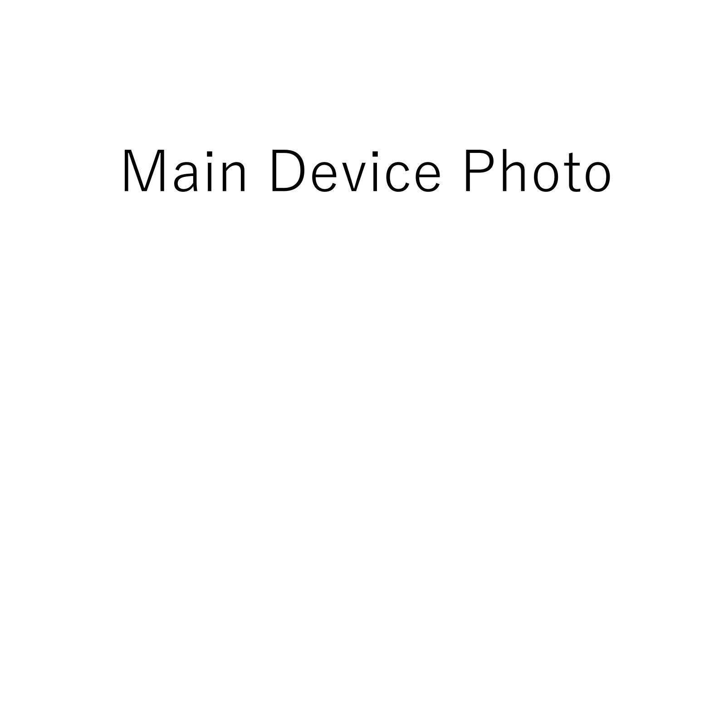

<!--- Open Source Assistive Technology: GitHub Readme Template Version 1.2 (2024-May-27)  --->

<!--- TEMPLATE INTRODUCTION --->
<!--- This section and the following text should be removed. --->
This is a GitHub repository intended to act as a template for an open source assistive technology device. It is meant to contain all design files, build files, and documentation for the project. More information about how to use the template is available in the [OpenAT_Template_Guide](/OpenAT_Template_Guide.pdf). You can see examples of other Open AT Devices at the Makers Making Change [website](https://www.makersmakingchange.com/s/category/assistive-devices). 

<!--- INSTRUCTIONS --->
<!--- This is a markdown template for creating the README.md file in a GitHub repository. This file is rendered and displayed automatically when someone visits the repository.

This document includes helper text that will not be displayed when rendered. Any text between the less-than sign + exclamation mark + three hyphen-minus (<!---) and matching three hyphen-minus + greater-than sign will not be displayed. This helper text can be deleted once the corresponding section is completed.

This template has a number of fields that can be searched and replaced with other text:
 - <Device_Name> Replace this with filename-friendly version of the device with underscores. e.g., Open_Wobble_Switch
 - <DeviceName> Replace this with the human-readable name of the device with spaces. e.g., Open Wobble Switch
 - <DesignerName> Replace this with the person or organization responsible for the design. e.g., John Doe.
 - <Repository_Link> Replace this with the web address for the repository. e.g., (e.g., https://github.com/makersmakingchange/Open-Wobble-Switch))
 - <MMCWebLink> This is the website address including an alphanumeric id for the Makers Making Change Website. e.g., 01tJR000000698oYAA. This will come from MMC staff.  
 - <MaterialCost> Replace this with the dollar cost and currency (CAD, USD, etc.) of the materials of the device.
 - <ShippingCost> Replace this with the dollar cost and currency (CAD, USD, etc.) of shipping the device (if possible).
 - <YEAR> year(s) of the copyright
 
Any text that is currently holding a space / is an instruction for the person filling in the README is in all capitals, to make it easier to see them in a rendered version.

--->
 
<!--- TITLE --->
# Collapsible Water Gun Stand
<!--- Should match the name of the GitHub repository. Choose something descriptive rather than whimsical.  --->

## Overview
<!--- A brief summary of the project. What it does, who it is for, how much it costs. --->
The Collapsible Water Gun Stand is an assistive technology device that uses a switch to trigger the water gun to shoot water. The water gun sits on top of a stand that was 3D printed.

<MODIFY LINE AS NECESSARY> The device is comprised of an off-the-shelf water gun that was adapted to fit our needs and 3D printed parts. 

The Collapsible Water Gun Stand is open assistive technology (OpenAT). Under the terms of the open source licenses, the device may be built, used, and improved upon by anyone.

The overall cost of materials is about $<MaterialCost> (plus $<ShippingCost> for component shipping) **Iqra will update.

.">

## Makers Making Change Assistive Device Library
<MMCWebLink>

## How to Obtain the Device
### 1. Do-it-Yourself (DIY) or Do-it-Together (DIT)

This is an open-source assistive technology, so anyone is free to build it. All of the files and instructions required to build the device are contained within this repository. Refer to the Maker Guide below.

## Build Instructions
<!--- Outline the major steps required to create a build --->

### 1. Read through the Maker Guide

The [Maker Guide](/Documentation/<Device_Name>_Maker_Guide.pdf)  contains all the necessary information to build this device, including tool lists, assembly instructions, and testing.

### 2. Order the Off-The-Shelf Components

The [Bill of Materials](/Documentation/<Device_Name>_BOM.xlsx) lists all of the parts and components required to build the device. ** Iqra will update

### 3. Print the 3D Printable components

All of the files and individual print files can be found in the [/Build_Files/3D_Printing_Files](/Build_Files/3D_Printing_Files/) folder.

### 4. Assemble the Collapsible Water Gun Stand

Reference the Assembly Guide section of the [Maker Guide](/Documentation/<Device_Name>_Maker_Guide.pdf) for the tools and steps required to build the device.

## How to improve this Device
As open source assistive technology, you are welcomed and encouraged to improve upon the design. 

## Files
### Documentation
<!--- Update the name, link, and version for documentation --->
| Document             | Version | Link |
|----------------------|---------|------|
| Design Rationale     | 1.0     | [<Device_Name>_Design_Rationale](/Documentation/<Device_Name>_Design_Rationale.pdf)     |
| Maker Guide          | 1.0     | [<Device_Name>_Maker_Guide](/Documentation/<Device_Name>_Maker_Guide.pdf)     |
| Bill of Materials    | 1.0     | [<Device_Name>_Bill_of_Materials](/Documentation/<Device_Name>_BOM.xlsx)     | **Iqra will update
| User Guide           | 1.0     | [<Device_Name>_User_Guide](/Documentation/<Device_Name>_User_Guide.pdf)    | **Iqra will update

<!---### Design Files
<!--- Include a copy of the original design files to facilitate easy editing and customization. Consider also including a generic format (e.g., STEP) --->

<!---### Build Files
<!--- Include a copy of the build files intended for manufacturing. This may include svg files for laser cutting, stl files for 3d printing, Gerber files for custom PCBs, and Arduino files for custom firmware. --->
<!--- - [3D Printing Files](/Build_Files/3D_Printing_Files)
 - [PCB Build Files](/Build_Files/PCB_Build_Files)
 - [Firmware Files](/Build/Firmware_Files)

## License
<!--- Add the year(s) for the copyright and the Designer Name. You may use the standard set of open licenses or choose your own for the hardware, software, and accompanying materials. --->
Copyright (c) 2025 Green Bean Team.

This repository describes Open Hardware:
 - Everything needed or used to design, make, test, or prepare the <DeviceName> is licensed under the [CERN 2.0 Weakly Reciprocal license (CERN-OHL-W v2) or later](https://cern.ch/cern-ohl ) .
 - All software is under the [GNU General Public License v3.0 (GPL-3.0)](https://www.gnu.org/licenses/gpl.html).
 - Accompanying material such as instruction manuals, videos, and other copyrightable works that are useful but not necessary to design, make, test, or prepare the <Device-Name> are published under a [Creative Commons Attribution-ShareAlike 4.0 license (CC BY-SA 4.0)](https://creativecommons.org/licenses/by-sa/4.0/) .

You may redistribute and modify this documentation and make products using it under the terms of the [CERN-OHL-W v2](https://cern.ch/cern-ohl).
This documentation is distributed WITHOUT ANY EXPRESS OR IMPLIED WARRANTY, INCLUDING OF MERCHANTABILITY, SATISFACTORY QUALITY AND FITNESS FOR A PARTICULAR PURPOSE.
Please see the CERN-OHL-W v2 for applicable conditions.

Source Location: [<Repository_Link> ](https://github.com/Iqra-Mohamed-Git/Design-Sprint-3.git)

## Attribution
<!--- Provide any necessary attribution for designs or components that are included in the device or as part of the project. --->
The Interact Switch design by Mike Turvey is used under CC-BY 4.0. Instructions adapted from Original Interact Switch Assembly Instructions by Mike Turvey, used under CC-BY 4.0. 1 2 3 4 5 6 7 V1.1 | AUGUST 2023 Interact Switch ASSEMBLY GUIDE © 2023 by Neil Squire / Makers Making Change. This work is licensed under the CC BY SA 4.0 License: http://creativecommons.org/licenses/by-sa/4.0 Files available at 

<!--- This is the attribution for the template. --->
The documentation template was created by Makers Making Change / Neil Squire Society and is used under a CC BY-SA 4.0 license. It is available at the following link: [https://github.com/makersmakingchange/OpenAT-Template](https://github.com/makersmakingchange/OpenAT-Template)

### Contributors
<!--- List the names of the people that contributed to the design. This could include the original source of the idea, designers, testers, documenters, etc. --->
Designers:
 - Kayla Olivas
 - Sam Kenney
 - Zander Leong
 - Iqra Mohammed

Testers:
 - Kayla Olivas
 - Sam Kenney
 - Zander Leong
 - Iqra Mohammed

---
<!--- This is standard boilerplate for Makers Making Change. No changes should be required. --->
<!-- ABOUT MMC START -->
## This project was inspired by Makers Making Change, learn more about them here:

Makers Making Change is a program of [Neil Squire](https://www.neilsquire.ca/), a Canadian non-profit that uses technology, knowledge, and passion to empower people with disabilities.

Makers Making Change leverages the capacity of community based Makers, Disability Professionals and Volunteers to develop and deliver affordable Open Source Assistive Technologies.

 - Website: [www.MakersMakingChange.com](https://www.makersmakingchange.com/)
 - GitHub: [makersmakingchange](https://github.com/makersmakingchange)
 - Bluesky: [@makersmakingchange.bsky.social](https://bsky.app/profile/makersmakingchange.bsky.social)
 - Instagram: [@makersmakingchange](https://www.instagram.com/makersmakingchange)
 - Facebook: [makersmakechange](https://www.facebook.com/makersmakechange)
 - LinkedIn: [Neil Squire Society](https://www.linkedin.com/company/neil-squire-society/)
 - Thingiverse: [makersmakingchange](https://www.thingiverse.com/makersmakingchange/about)
 - Printables: [MakersMakingChange](https://www.printables.com/@MakersMakingChange)

